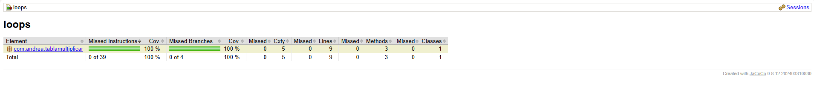

# Loops - Tabla de Multiplicar

Ejercicio del bootcamp de desarrollo web full-stack de Factoría F5 Asturias, correspondiente al tema de **Loops** (bucles) en Java.

## Enunciado

Crear una clase que tenga la responsabilidad de generar la tabla de multiplicar de un número. Dado un número entero `n`, debe devolver su tabla de multiplicar (del 1 al 10), donde cada línea sigue el formato `n x i = resultado`.

**Ejemplo** (n = 5):
```
5 x 1 = 5
5 x 2 = 10
5 x 3 = 15
5 x 4 = 20
5 x 5 = 25
5 x 6 = 30
5 x 7 = 35
5 x 8 = 40
5 x 9 = 45
5 x 10 = 50
```

## Diseño y decisiones

- **`MultiplicationTable`** es la clase con la responsabilidad única (SRP) de calcular la tabla. No imprime nada directamente — **devuelve** una `List<String>` con las 10 líneas, para que el resultado sea fácilmente testeable con JUnit.
- **`App`** es un punto de entrada independiente (con `main`) que usa `MultiplicationTable` y se encarga de imprimir el resultado por consola, separando así la lógica de negocio de la presentación.
- Si `n` es negativo, `generateTable` lanza una `IllegalArgumentException`, ya que no se considera un caso válido de negocio (aunque matemáticamente calculable).
- Si `n = 0`, se considera un caso válido: la tabla se genera igual, con todos los resultados en cero.

## Estructura de las clases

### `MultiplicationTable`

| Método | Descripción |
|---|---|
| `multiply(int n, int i)` | Calcula el producto `n * i`. Aislado para poder testearlo de forma independiente. |
| `generateTable(int n)` | Recorre `i` de 1 a 10, usa `multiply` para calcular cada resultado, y devuelve una `List<String>` con cada línea en formato `n x i = resultado`. Lanza `IllegalArgumentException` si `n < 0`. |

### `App`

Contiene el método `main`, que crea una instancia de `MultiplicationTable`, genera la tabla de un número de ejemplo, y la imprime por consola línea a línea.

## Cómo ejecutar el proyecto

**Ejecutar los tests:**
```bash
mvn test
```

**Ejecutar los tests limpiando la carpeta target primero** (recomendado si has hecho cambios):
```bash
mvn clean test
```

**Ver la tabla de multiplicar impresa por consola:**
```bash
mvn compile exec:java -Dexec.mainClass="com.andrea.tablamultiplicar.App"
```

## Tecnologías utilizadas

- **Java 21**
- **Maven** (gestión de dependencias y build)
- **JUnit 5** (framework de testing)
  - `@ParameterizedTest` + `@CsvSource` para tests parametrizados
- **JaCoCo** (medición de cobertura de tests)
- **exec-maven-plugin** (para ejecutar `App.main()` desde Maven)

## Testing

La clase `MultiplicationTable` cuenta con **8 tests**, organizados en 3 escenarios:

1. **Cálculo de multiplicaciones** (`shouldCalculateMultiplication`) — parametrizado con 4 casos distintos (`n`, `i`, resultado esperado), incluyendo el caso especial de `n = 0`.
2. **Generación completa de la tabla** (`shouldGenerateTable`) — comprueba que la lista devuelta tiene 10 elementos y que una línea concreta coincide exactamente con el formato esperado.
3. **Manejo de números negativos** (`shouldThrowExceptionWhenNegative`) — parametrizado con 3 valores negativos distintos, comprobando que se lanza `IllegalArgumentException` en todos los casos.

### Cobertura de tests

Se obtuvo una cobertura del **100%** sobre `MultiplicationTable` (instrucciones y ramas). La clase `App` se excluyó deliberadamente del cálculo de cobertura en la configuración de JaCoCo (`pom.xml`), ya que solo contiene código de presentación (`System.out.println`) y no lógica de negocio a testear.



